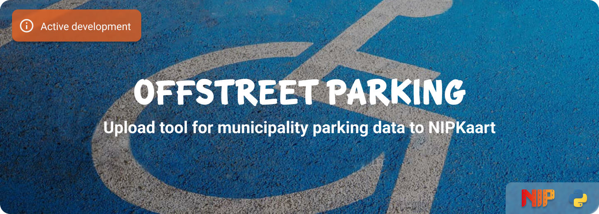

<!--
*** To avoid retyping too much info. Do a search and replace for the following:
*** github_username, repo_name
-->

<!-- Banner -->


<!-- PROJECT SHIELDS -->
[![GitHub Activity][commits-shield]][commits]
[![GitHub Last Commit][last-commit-shield]][commits]
[![Linting][linting-shield]][linting-url]

![Project Maintenance][maintenance-shield]
[![License][license-shield]](LICENSE.md)
[![Contributors][contributors-shield]][contributors-url]

[![Forks][forks-shield]][forks-url]
[![Stargazers][stars-shield]][stars-url]
[![Issues][issues-shield]][issues-url]

## About

This project makes it possible to collect data from municipalities about off-street parking spaces (garages or park and rides) and upload them to the [NIPKaart][nipkaart] platform.

## Supported cities

| Country | City | Type | Update interval |
|:--------|:-----|:-----|:----------------|
| Netherlands | [Amsterdam](https://github.com/klaasnicolaas/python-garages-amsterdam) | Parking garages | Every 10 minutes |
| Germany | [Hamburg](https://github.com/klaasnicolaas/python-hamburg) | Park and rides | Every 30 minutes (paused in midnight) |

## Development

This Python project is fully managed using the [Poetry][poetry] dependency
manager.

You need at least:

- Python 3.10+
- [Poetry][poetry-install]


1. Create a `.env` file
```bash
cp .env.example .env
```

2. Fillout the database credentials and which city you want to upload
3. Change the `city` and `wait_time` (in minutes) in the **.env** file.
4. Install all packages, including all development requirements:

```bash
poetry install
```

Poetry creates by default an virtual environment where it installs all
necessary pip packages, to enter or exit the venv run the following commands:

```bash
poetry shell
exit
```

Setup the pre-commit check, you must run this inside the virtual environment:

```bash
pre-commit install
```

*Now you're all set to get started!*

As this repository uses the [pre-commit][pre-commit] framework, all changes
are linted and tested with each commit. You can run all checks and tests
manually, using the following command:

```bash
poetry run pre-commit run --all-files
```

<details>
  <summary>Click here to see more!</summary>

### Build image

Build docker image, type could be `parkandride` or `garages`

```bash
docker build -t nipkaart-[TYPE]-[CITY] .
```

### Run the image

```bash
docker run nipkaart-[TYPE]-[CITY] -d --restart on-failure --name nipkaart-[TYPE]-[CITY]
```

or

```bash
docker stack deploy -c deploy/[CITY].yml offstreet
```

</details>

## Contributing

Would you like to contribute to the development of this project? Then read the prepared [contribution guidelines](CONTRIBUTING.md) and go ahead!

Thank you for being involved! :heart_eyes:

## License

MIT License

Copyright (c) 2021-2023 Klaas Schoute

Permission is hereby granted, free of charge, to any person obtaining a copy
of this software and associated documentation files (the "Software"), to deal
in the Software without restriction, including without limitation the rights
to use, copy, modify, merge, publish, distribute, sublicense, and/or sell
copies of the Software, and to permit persons to whom the Software is
furnished to do so, subject to the following conditions:

The above copyright notice and this permission notice shall be included in all
copies or substantial portions of the Software.

THE SOFTWARE IS PROVIDED "AS IS", WITHOUT WARRANTY OF ANY KIND, EXPRESS OR
IMPLIED, INCLUDING BUT NOT LIMITED TO THE WARRANTIES OF MERCHANTABILITY,
FITNESS FOR A PARTICULAR PURPOSE AND NONINFRINGEMENT. IN NO EVENT SHALL THE
AUTHORS OR COPYRIGHT HOLDERS BE LIABLE FOR ANY CLAIM, DAMAGES OR OTHER
LIABILITY, WHETHER IN AN ACTION OF CONTRACT, TORT OR OTHERWISE, ARISING FROM,
OUT OF OR IN CONNECTION WITH THE SOFTWARE OR THE USE OR OTHER DEALINGS IN THE
SOFTWARE.

[nipkaart]: https://nipkaart.nl

<!-- MARKDOWN LINKS & IMAGES -->
[maintenance-shield]: https://img.shields.io/maintenance/yes/2023.svg
[contributors-shield]: https://img.shields.io/github/contributors/nipkaart/offstreet-parking.svg
[contributors-url]: https://github.com/nipkaart/offstreet-parking/graphs/contributors
[forks-shield]: https://img.shields.io/github/forks/nipkaart/offstreet-parking.svg
[forks-url]: https://github.com/nipkaart/offstreet-parking/network/members
[stars-shield]: https://img.shields.io/github/stars/nipkaart/offstreet-parking.svg
[stars-url]: https://github.com/nipkaart/offstreet-parking/stargazers
[issues-shield]: https://img.shields.io/github/issues/nipkaart/offstreet-parking.svg
[issues-url]: https://github.com/nipkaart/offstreet-parking/issues
[license-shield]: https://img.shields.io/github/license/nipkaart/offstreet-parking.svg
[commits-shield]: https://img.shields.io/github/commit-activity/y/nipkaart/offstreet-parking.svg
[commits]: https://github.com/nipkaart/offstreet-parking/commits/main
[last-commit-shield]: https://img.shields.io/github/last-commit/nipkaart/offstreet-parking.svg
[linting-shield]: https://github.com/NIPKaart/offstreet-parking/actions/workflows/linting.yml/badge.svg
[linting-url]: https://github.com/NIPKaart/offstreet-parking/actions/workflows/linting.yml

[poetry-install]: https://python-poetry.org/docs/#installation
[poetry]: https://python-poetry.org
[pre-commit]: https://pre-commit.com
