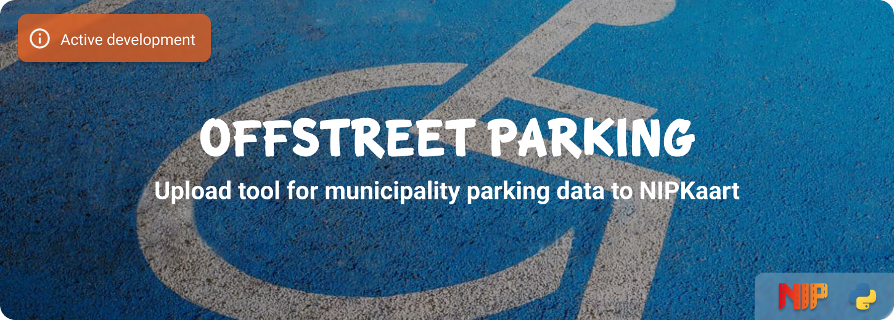

<!--
*** To avoid retyping too much info. Do a search and replace for the following:
*** github_username, repo_name
-->

<!-- Banner -->


<!-- PROJECT SHIELDS -->
[![GitHub Activity][commits-shield]][commits]
[![GitHub Last Commit][last-commit-shield]][commits]
[![Linting][linting-shield]][linting-url]

![Project Maintenance][maintenance-shield]
[![License][license-shield]](LICENSE.md)
[![Contributors][contributors-shield]][contributors-url]

[![Forks][forks-shield]][forks-url]
[![Stargazers][stars-shield]][stars-url]
[![Issues][issues-shield]][issues-url]

## About

Collect Amsterdam car garages and P+R for [NIPKaart][nipkaart] as two separate streams, delivered as JSON files to a private Cloudflare R2 bucket. Core picks them up from there. This collector has no core API or database credentials.

| Stream | Content | Cadence | R2 key | Core |
| --- | --- | --- | --- | --- |
| Catalog ([#656](https://github.com/NIPKaart/offstreet-parking/issues/656)) | Identity, name, type, location, capacity | Daily | `offstreet/<dataset>/<delivery_id>.json` | [core#1250](https://github.com/NIPKaart/core/issues/1250): review and publication |
| Observations ([#657](https://github.com/NIPKaart/offstreet-parking/issues/657)) | Source time, state, free spaces | Every 2 minutes | `offstreet-observations/<dataset>/<YYYYMMDDTHHMMSSZ>-<delivery_id>.json` | [core#1221](https://github.com/NIPKaart/core/issues/1221): live update |

Both formats are contract candidates until core accepts them.

## Development

Use Python 3.14 and [uv](https://docs.astral.sh/uv/):

```bash
uv sync --locked --python 3.14
uv run python -m unittest discover -s tests -v
uv run pre-commit run --all-files
```

Source HTTP and parsing live in the [`odp-amsterdam`](https://github.com/klaasnicolaas/python-odp-amsterdam) package (`>=7.0.2,<7.1.0`); this repository only selects car facilities and maps them. `main.py --fetch amsterdam|hamburg` is the legacy inspection command. It prints a count and writes nothing.

## Formats

Both envelopes contain `format`, `dataset` (`nl-amsterdam-garages`), `selection` (`car-garages-and-pr`), a new `delivery_id` UUID per retrieval, `source_count` and `records` sorted by `external_id`. The catalog adds `retrieved_at`, `complete: true` and a `source` block; observations add `fetched_at`. Timestamps are UTC ISO 8601.

The catalog's `source` block describes the dataset so that core can discover it and an administrator can approve it once ([core ADR 0013](https://github.com/NIPKaart/core/blob/main/docs/adr/0013-discover-dataset-sources-from-deliveries-with-one-time-approval.md)). It comes from the dataset registry in `app/datasets.py` and is identical in every delivery of that dataset:

```json
"source": {
  "name": "Amsterdam parkeergarages en P+R",
  "publisher": "Gemeente Amsterdam",
  "source_url": "https://p-info.vorin-amsterdam.nl/v1/ParkingLocation.json",
  "licence": "CC-BY-4.0",
  "terms_url": "https://data.overheid.nl/dataset/9orkef6t-au29g",
  "attribution": "Gemeente Amsterdam; Actuele beschikbaarheid Parkeergarages; CC-BY 4.0.",
  "area": {"country": "NL", "subdivision": "NL-NH", "municipality": {"scheme": "nl-cbs", "code": "GM0363", "name": "Amsterdam"}},
  "bounds": [4.65, 52.2, 5.15, 52.5],
  "expected_interval_hours": 24
}
```

`licence` is an SPDX identifier, or `null` when the source publishes none. `area` uses ISO 3166 codes and the official municipality code (CBS for the Netherlands). Every facility must lie within `bounds`. Changing any of these values makes core ask for approval again, except `expected_interval_hours`.

Catalog record (`nipkaart-offstreet-catalog-2`):

```json
{
  "external_id": "06757815-834C-0E44-42B0-AE4FC4AF9CEF",
  "name": "Byzantium",
  "source_name": "P-106_ Byzantium (opendata)",
  "facility_type": "garage",
  "geometry": {"type": "Point", "coordinates": [4.88001, 52.3619]},
  "short_capacity": 446,
  "long_capacity": null,
  "accessible_capacity": null
}
```

Observation record (`nipkaart-offstreet-observations-1`):

```json
{
  "external_id": "06757815-834C-0E44-42B0-AE4FC4AF9CEF",
  "observed_at": "2026-09-28T09:13:05Z",
  "source_state": "ok",
  "short_available": 349,
  "long_available": null,
  "accessible_available": null
}
```

Rules for both:

- `external_id` is the original source ID and joins the two streams. A missing observation never means a facility was removed.
- `null` means unknown and `0` means zero. Short-stay (visitors) and long-stay (season tickets) counts stay separate and are never summed.
- Amsterdam sends capacity `0` with `0` free for malfunctions (`STORING_DEFAULT`) and for P+R sites that only report a free/full status. A capacity of `0` is therefore stored as unknown, and so are free spaces when the capacity is unknown.
- General capacity or free spaces never imply accessible spaces. The source provides no accessible data, so those fields are `null`.
- `name` is the package's readable name; `source_name` is the original label. Coordinates are WGS84 longitude, latitude.
- The catalog holds no live values, so a daily review only shows real metadata changes.
- Observations pass the source values on unchanged. `observed_at` is the source's own measurement time (`null` if absent), not the fetch time. `source_state` is the source status: the feed reports `ok` or `error`. Core decides freshness and must not show counts from a non-`ok` state as current availability.

A retrieval is rejected as a whole when it is empty, has duplicate or blank IDs, invalid locations or counts, more than 10,000 records or more than 32 MiB, or does not finish within 180 seconds. Amsterdam coordinates must lie within latitude 52–53 and longitude 4–6.

## Local export

Write one delivery to a file without R2 or core. A failed export keeps the previous file intact.

```bash
uv run python export.py --city amsterdam --output /tmp/catalog.json
uv run python export.py --city amsterdam --kind observations --output /tmp/observations.json
```

## R2 delivery

Deliver to the existing private EU bucket `nipkaart-imports`, next to the municipal collector's `municipal/` prefix. Reuse the municipal collector's R2 token (Object Read & Write, scoped to that bucket) and enter it in `.env` (see `.env.example`). The collector itself never overwrites or deletes objects. Core reads with its existing credentials.

```bash
uv run --env-file .env python collector.py --city amsterdam --directory /tmp/offstreet
uv run --env-file .env python collector.py --city amsterdam --kind observations
```

Every upload is one `PutObject` with `If-None-Match: *` and a SHA-256 checksum. If the object already exists, the upload only succeeds when the remote bytes are identical. The collector never deletes or overwrites objects.

- **Catalog:** first saved as `<directory>/nl-amsterdam-garages/pending.json`. After a failure, that same file is retried before anything new is fetched, and it moves to `last.json` once it is delivered. Do not edit or delete the pending file to recover.
- **Observations:** fetched and uploaded straight away, with no local state. A failure delivers nothing; the next run two minutes later is newer anyway.

## Retention

Set these two lifecycle rules on `nipkaart-imports` once, before the first delivery:

| Rule name | Prefix | Delete after | Why |
| --- | --- | --- | --- |
| `expire-offstreet-catalog` | `offstreet/` | 30 days | Well beyond the 7-day core outage window, same as `municipal/` |
| `expire-offstreet-observations` | `offstreet-observations/` | 7 days | Outdated within minutes; kept only for debugging |

The trailing slash matters: `offstreet/` does not match `offstreet-observations/`. Never add a rule without a prefix, because it would also delete municipal deliveries.

**Dashboard:** R2 → `nipkaart-imports` → Settings → Object lifecycle rules → Add rule. Enter the name and prefix, choose to delete objects after the number of days in the table, and save. Repeat for the second rule.

**Or with Wrangler** (after `npx wrangler login`; the bucket is in the EU jurisdiction):

```bash
npx wrangler r2 bucket lifecycle add nipkaart-imports expire-offstreet-catalog offstreet/ --expire-days 30 --jurisdiction eu
npx wrangler r2 bucket lifecycle add nipkaart-imports expire-offstreet-observations offstreet-observations/ --expire-days 7 --jurisdiction eu
npx wrangler r2 bucket lifecycle list nipkaart-imports --jurisdiction eu
```

The list should show both offstreet rules plus the municipal rule (`municipal/`, 30 days) from [disabled-parking](https://github.com/NIPKaart/disabled-parking#retention).

## Scheduling

```bash
docker compose up -d
```

`compose.yaml` runs two independent services on one volume. Each has its own lock and a deadline for each run:

- `collector`: catalog, every `COLLECTOR_INTERVAL_SECONDS` (default 86,400); retries after at most 5 minutes.
- `observations`: every `OBSERVATION_INTERVAL_SECONDS` (default 120).

On 2026-09-28 the source's observations had a median age of ~40 seconds (range 17 seconds to 5 minutes), so the feed refreshes about once a minute. Existing jobs and legacy data are not touched.

## Contributing

Would you like to contribute to the development of this project? Then read the prepared [contribution guidelines](CONTRIBUTING.md) and go ahead!

Thank you for being involved! :heart_eyes:

## License

MIT License

Copyright (c) 2021-2024 Klaas Schoute

Permission is hereby granted, free of charge, to any person obtaining a copy
of this software and associated documentation files (the "Software"), to deal
in the Software without restriction, including without limitation the rights
to use, copy, modify, merge, publish, distribute, sublicense, and/or sell
copies of the Software, and to permit persons to whom the Software is
furnished to do so, subject to the following conditions:

The above copyright notice and this permission notice shall be included in all
copies or substantial portions of the Software.

THE SOFTWARE IS PROVIDED "AS IS", WITHOUT WARRANTY OF ANY KIND, EXPRESS OR
IMPLIED, INCLUDING BUT NOT LIMITED TO THE WARRANTIES OF MERCHANTABILITY,
FITNESS FOR A PARTICULAR PURPOSE AND NONINFRINGEMENT. IN NO EVENT SHALL THE
AUTHORS OR COPYRIGHT HOLDERS BE LIABLE FOR ANY CLAIM, DAMAGES OR OTHER
LIABILITY, WHETHER IN AN ACTION OF CONTRACT, TORT OR OTHERWISE, ARISING FROM,
OUT OF OR IN CONNECTION WITH THE SOFTWARE OR THE USE OR OTHER DEALINGS IN THE
SOFTWARE.

[nipkaart]: https://nipkaart.nl

<!-- MARKDOWN LINKS & IMAGES -->
[maintenance-shield]: https://img.shields.io/maintenance/yes/2024.svg
[contributors-shield]: https://img.shields.io/github/contributors/nipkaart/offstreet-parking.svg
[contributors-url]: https://github.com/nipkaart/offstreet-parking/graphs/contributors
[forks-shield]: https://img.shields.io/github/forks/nipkaart/offstreet-parking.svg
[forks-url]: https://github.com/nipkaart/offstreet-parking/network/members
[stars-shield]: https://img.shields.io/github/stars/nipkaart/offstreet-parking.svg
[stars-url]: https://github.com/nipkaart/offstreet-parking/stargazers
[issues-shield]: https://img.shields.io/github/issues/nipkaart/offstreet-parking.svg
[issues-url]: https://github.com/nipkaart/offstreet-parking/issues
[license-shield]: https://img.shields.io/github/license/nipkaart/offstreet-parking.svg
[commits-shield]: https://img.shields.io/github/commit-activity/y/nipkaart/offstreet-parking.svg
[commits]: https://github.com/nipkaart/offstreet-parking/commits/main
[last-commit-shield]: https://img.shields.io/github/last-commit/nipkaart/offstreet-parking.svg
[linting-shield]: https://github.com/NIPKaart/offstreet-parking/actions/workflows/linting.yaml/badge.svg
[linting-url]: https://github.com/NIPKaart/offstreet-parking/actions/workflows/linting.yaml

[pre-commit]: https://pre-commit.com
